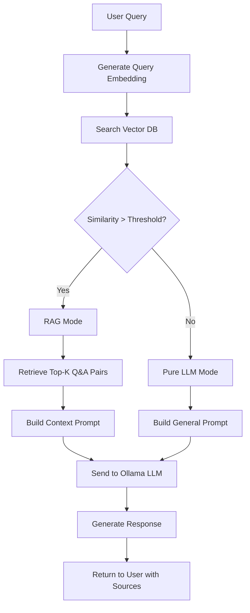

# कानून - AI Legal Assistant Documentation

## Overview

**कानून (Kanoon)** is an AI-powered legal assistant chatbot designed to help users with Indian legal queries. It leverages a **Retrieval-Augmented Generation (RAG)** pipeline combined with a Large Language Model (LLM) to provide accurate, context-aware legal information based on the Indian Constitution, legal cases.

### Key Features:
- **Real-time Legal Q&A** - Get instant answers to legal questions
-  **Hybrid RAG/LLM Mode** - Automatically switches between database-backed and general knowledge responses
---

## Tech Stack

### Frontend
| Technology | Purpose | Version |
|------------|---------|---------|
| **React** | UI Framework | 18.3.1 |
| **TypeScript** | Type Safety | 5.8.3 |
| **Vite** | Build Tool & Dev Server | 5.4.19 |
| **Shadcn UI** | Component Library | Latest |
| **Tailwind CSS** | Styling | 3.4.17 |
| **React Router** | Navigation | 6.30.1 |
| **Lucide React** | Icons | 0.462.0 |

### Backend
| Technology | Purpose | Version |
|------------|---------|---------|
| **FastAPI** | Web Framework | Latest |
| **Python** | Programming Language | 3.12+ |
| **Uvicorn** | ASGI Server | Latest |
| **ChromaDB** | Vector Database | Latest |
| **Sentence Transformers** | Embeddings | Latest |
| **Ollama** | Local LLM Runtime | Latest |
| **Qwen 3** | Language Model | 8B parameters |

### Data Processing
| Technology | Purpose |
|------------|---------|
| **Hugging Face Datasets** | Data Loading |
| **Beautiful Soup** | Web Scraping (optional) |
| **Pandas** | Data Manipulation |
| **tqdm** | Progress Bars |

---

## 📁 Repository Structure

```
Ith/
├── backend/
│   ├── models/
│   │   ├── main.py                    # FastAPI application & API endpoints
│   │   ├── rag_pipeline.py            # RAG pipeline implementation
│   │   ├── vector_database.py         # ChromaDB vector database manager
│   │   ├── data/
│   │   │   └── vectordb/              # ChromaDB persistent storage
│   │   │       ├── chroma.sqlite3
│   │   │       └── e1567276.../       # Vector embeddings
│   │   └── __pycache__/
│   │
│   ├── scrapers/
│   │   ├── dt.py                      # Hugging Face dataset loader
│   │   └── data/
│   │       └── raw/
│   │           └── legal_data_all.json # Raw legal Q&A dataset
│   │
│   ├── requirements.txt               # Python dependencies
│   └── .env                           # Environment variables
│
├── frontend/
│   ├── src/
│   │   ├── components/
│   │   │   ├── ChatInterface.tsx      # Main chat component
│   │   │   ├── Navigation.tsx         # Header navigation
│   │   │   ├── Footer.tsx             # Footer component
│   │   │   └── ui/                    # Shadcn UI components
│   │   │
│   │   ├── services/
│   │   │   └── api.ts                 # API service for backend communication
│   │   │
│   │   ├── pages/
│   │   │   ├── Index.tsx              # Landing page
│   │   │   └── NotFound.tsx           # 404 page
│   │   │
│   │   ├── lib/
│   │   │   └── utils.ts               # Utility functions
│   │   │
│   │   ├── App.tsx                    # Main app component
│   │   └── main.tsx                   # App entry point
│   │
│   ├── package.json                   # Node dependencies
│   ├── vite.config.ts                 # Vite configuration
│   ├── tailwind.config.ts             # Tailwind configuration
│   └── .env                           # Frontend environment variables
│
└── DOCUMENTATION.md                   # This file
```

---

## How It Works

```
┌─────────────┐      HTTP/REST      ┌──────────────┐
│   Frontend  │ ◄─────────────────► │   FastAPI    │
│   (React)   │      JSON Data      │   Backend    │
└─────────────┘                      └──────────────┘
                                            │
                                            │
                                            ▼
                      ┌─────────────────────────────────────┐
                      │      RAG Pipeline Manager           │
                      └─────────────────────────────────────┘
                                   │          │
                         ┌─────────┴──────────┴─────────┐
                         │                               │
                         ▼                               ▼
                  ┌─────────────┐              ┌─────────────┐
                  │  ChromaDB   │              │   Ollama    │
                  │ Vector DB   │              │  (Qwen3)    │
                  └─────────────┘              └─────────────┘
                  Embeddings Search            Text Generation
```

### Breakdown

#### 1. **Frontend (React + TypeScript)**
- **API Service**: Handles all HTTP requests to backend
- **State Management**: React hooks (useState, useEffect) for local state

#### 2. **Backend API (FastAPI)**
- **CORS Configuration**: Allows frontend-backend communication
- **Request Validation**: Pydantic models for type safety

#### 3. **Vector Database (ChromaDB)**
- **Embedding Model**: `sentence-transformers/all-MiniLM-L6-v2`
- **Search**: Cosine similarity search for relevant Q&A pairs
- **Metadata**: Stores question, answer, and other metadata

#### 4. **RAG Pipeline**
- **Document Retrieval**: Fetches top-k similar Q&A pairs from ChromaDB
- **Hybrid Mode**: Switches between RAG and pure LLM based on similarity threshold
- **LLM Generation**: Sends prompt to Ollama (Qwen3) for response generation

#### 5. **LLM (Ollama + Qwen3)**
- **Local Execution**: Runs on user's machine (no API costs)
- **Model**: Qwen3 8B - optimized for chat and instruction following
- **Temperature**: 0.2 for more factual, consistent responses
- **Max Tokens**: 1500 tokens (~1000-1200 words)

---

## RAG + LLM Architecture

### What is RAG?

**Retrieval-Augmented Generation** is a technique that combines:
1. **Information Retrieval** - Finding relevant documents from a database
2. **Text Generation** - Using an LLM to generate responses based on retrieved context

### How RAG Works in This Project



### RAG Pipeline Steps

#### Step 1: Query Processing
```python
# User asks: "What are fundamental rights?"
query = "What are fundamental rights in Indian Constitution?"
```

#### Step 2: Embedding Generation
```python
# Convert query to vector representation
query_embedding = embedding_model.encode(query)
# Result: [0.123, -0.456, 0.789, ...] (384 dimensions)
```

#### Step 3: Similarity Search
```python
# Search ChromaDB for similar Q&A pairs
results = vector_db.search(query_embedding, top_k=5)
# Returns: Top 5 most similar questions with their answers
```

#### Step 4: Relevance Check
```python
# Calculate average similarity
avg_similarity = 1 - avg_distance
threshold = 0.35  # Configurable

if avg_similarity >= threshold:
    mode = "RAG"  # Use database context
else:
    mode = "LLM"  # Use general knowledge
```

#### Step 5: Prompt Construction

**RAG Mode (with context):**
```
System: You are an AI legal assistant...

Context from Database:
[Reference 1] (ID: qa_123):
Question: What are fundamental rights?
Answer: Fundamental rights are basic human rights enshrined in Part III...


**LLM Mode (no context):**
```
System: You are an AI legal assistant with expertise in Indian law...
Note: This response is based on general knowledge.

User: What are fundamental rights in Indian Constitution?
Assistant:
```

#### Step 6: Response Generation
```python
# Send prompt to Ollama
response = ollama.generate(
    model="qwen3:8b",
    prompt=prompt,
    temperature=0.2,
    max_tokens=1500
)
```

#### Step 7: Response Formatting


## 📊 Workflow & Flowchart

### Complete System Workflow

```
┌──────────────────────────────────────────────────────────────────┐
│                         USER INTERACTION                          │
└───────────────────────────┬──────────────────────────────────────┘
                            │
                            ▼
┌─────────────────────────────────────────────────────────────────┐
│ 1. USER TYPES QUERY                                              │
│    Example: "What is Article 21 of Indian Constitution?"        │
└───────────────────────────┬─────────────────────────────────────┘
                            │
                            ▼
┌─────────────────────────────────────────────────────────────────┐
│ 2. FRONTEND SENDS REQUEST                                        │
│    POST /api/chat                                                │
│    Body: { query, conversation_id?, top_k? }                     │
└───────────────────────────┬─────────────────────────────────────┘
                            │
                            ▼
┌─────────────────────────────────────────────────────────────────┐
│ 3. BACKEND RECEIVES REQUEST                                      │
│    - Validates input (max 1000 chars)                            │
│    - Checks RAG pipeline status                                  │
└───────────────────────────┬─────────────────────────────────────┘
                            │
                            ▼
┌─────────────────────────────────────────────────────────────────┐
│ 4. GENERATE QUERY EMBEDDING                                      │
│    - Use Sentence Transformer model                              │
│    - Convert text to 384-dim vector                              │
└───────────────────────────┬─────────────────────────────────────┘
                            │
                            ▼
┌─────────────────────────────────────────────────────────────────┐
│ 5. SEARCH VECTOR DATABASE (ChromaDB)                             │
│    - Cosine similarity search                                    │
│    - Retrieve top-5 Q&A pairs                                    │
│    - Calculate similarity scores                                 │
└───────────────────────────┬─────────────────────────────────────┘
                            │
                            ▼
                ┌───────────┴───────────┐
                │                       │
                ▼                       ▼
    ┌───────────────────┐   ┌───────────────────┐
    │ Similarity >= 0.35│   │ Similarity < 0.35 │
    │   RAG MODE        │   │   LLM MODE        │
    └─────────┬─────────┘   └─────────┬─────────┘
              │                       │
              ▼                       ▼
    ┌─────────────────┐   ┌─────────────────────┐
    │ Build RAG Prompt│   │ Build General Prompt│
    │ - Add Q&A pairs │   │ - No database info  │
    │ - Add sources   │   │ - General knowledge │
    └─────────┬───────┘   └─────────┬───────────┘
              │                     │
              └──────────┬──────────┘
                         │
                         ▼
┌─────────────────────────────────────────────────────────────────┐
│ 6. SEND PROMPT TO OLLAMA (Qwen3:8b)                             │
│    - Temperature: 0.2                                            │
│    - Max tokens: 1500                                            │
│    - Timeout: 120s                                               │
└───────────────────────────┬─────────────────────────────────────┘
                            │
                            ▼
┌─────────────────────────────────────────────────────────────────┐
│ 7. OLLAMA GENERATES RESPONSE                                     │
│    - Processes prompt                                            │
│    - Generates coherent answer                                   │
│    - Returns text response                                       │
└───────────────────────────┬─────────────────────────────────────┘
                            │
                            ▼
┌─────────────────────────────────────────────────────────────────┐
│ 8. FORMAT RESPONSE WITH SOURCES                                  │
│    - Extract source metadata                                     │
│    - Format citations                                            │
│    - Update conversation history                                 │
└───────────────────────────┬─────────────────────────────────────┘
                            │
                            ▼
┌─────────────────────────────────────────────────────────────────┐
│ 9. SEND RESPONSE TO FRONTEND                                     │
│    {                                                             │
│      response: "Article 21 states...",                           │
│      sources: [...],                                             │
│      conversation_id: "uuid",                                    │
│      timestamp: "2025-10-29T..."                                 │
│    }                                                             │
└───────────────────────────┬─────────────────────────────────────┘
                            │
                            ▼
┌─────────────────────────────────────────────────────────────────┐
│ 10. FRONTEND DISPLAYS RESPONSE                                   │
│     - Shows bot message with answer                              │
│     - Displays source cards below                                │
│     - Maintains conversation context                             │
└─────────────────────────────────────────────────────────────────┘
```


## Setup & Installation

### Prerequisites
- Python 3.12+
- Node.js 18+
- Ollama installed
- Git

### Step 1: Clone Repository
```bash
git clone <repository-url>
cd Ith
```

### Step 2: Backend Setup

```bash
# Navigate to backend
cd backend

# Create virtual environment
python -m venv venv
source venv/bin/activate  # On Windows: venv\Scripts\activate

# Install dependencies
pip install -r requirements.txt

# Set up environment variables
# Create .env file in backend directory with:
# FRONTEND_ORIGINS=http://localhost:5173
# OLLAMA_MODEL=qwen3:8b
# OLLAMA_BASE_URL=http://localhost:11434
# VECTOR_DB_PATH=./data/vectordb
```

### Step 3: Load Dataset

```bash
# Navigate to scrapers
cd scrapers

# Run dataset loader
python dt.py

# This will download the dataset from Hugging Face and save it
# Follow the prompts to process all examples
```

### Step 4: Build Vector Database

```bash
# Navigate to models
cd ../models

# Run vector database setup
python vector_database.py

# This will:
# 1. Create ChromaDB instance
# 2. Generate embeddings for all Q&A pairs
# 3. Store in persistent database
```

### Step 5: Install Ollama Model

```bash
# Pull the Qwen3 8B model
ollama pull qwen3:8b

# Verify it's running
ollama list
```

### Step 6: Start Backend Server

```bash
# In backend/models directory
python -m uvicorn main:app --reload --port 8000

# Or simply
python main.py
```

### Step 7: Frontend Setup

```bash
# Navigate to frontend
cd ../../frontend

# Install dependencies
npm install

# Create .env file with:
# VITE_API_BASE_URL=http://localhost:8000

# Start development server
npm run dev
```

### Step 8: Access Application

Open browser and navigate to:
- Frontend: `http://localhost:5173`
- Backend API Docs: `http://localhost:8000/docs`

---


## Screenshots


## Future Enhancements

- [ ] User authentication and sessions
- [ ] Chat history persistence
- [ ] Export chat as PDF
- [ ] Multi-language support
- [ ] Voice input/output

---

## Contributors

- **Radhakrishna Bharuka** - 
- **Nilesh Dwivedi**-
- **Hari Krishna Sharma**-

---

## License

This project is licensed under the MIT License.

---

## Acknowledgments

- **Hugging Face** - For the `viber1/indian-law-dataset`

---

## Contact

For questions or support, please reach out:
- Email: radhebharuka29@gmail.com

---

